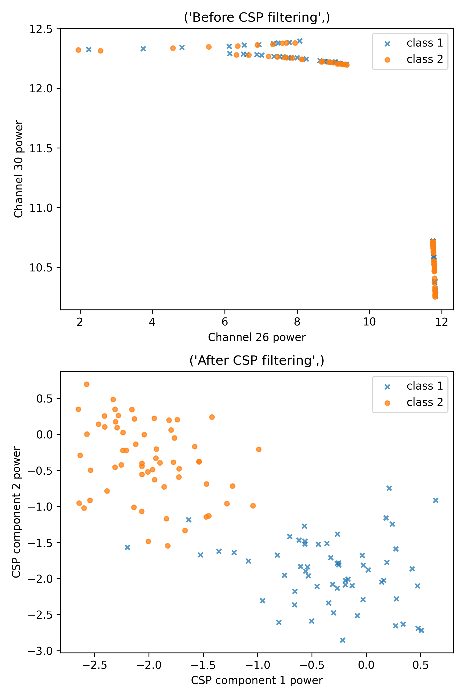

# EEG Decoder

Classifies left vs. right motor imagery from EEG using CSP + LDA



Top: raw channel power, where the classes overlap. Bottom: after CSP, where they separate. (More plots are in `results/`.)

## How it works

1. Clean up the EEG: common average reference, downsample to 100 Hz, band-pass filter to 4–40 Hz
2. **CSP** finds spatial filters that make one class's signal strong and the other's weak
3. **LDA** draws a line between the two classes using those features
4. Compare against the online decoder's accuracy

## Run it

```bash
pip install -r requirements.txt
cd alg
python CSP_LDA_Assignment.py
```

The `.mat` data files are too big for GitHub, so put them in `data/` yourself. To switch datasets, change `session_file` at the top of the script.
